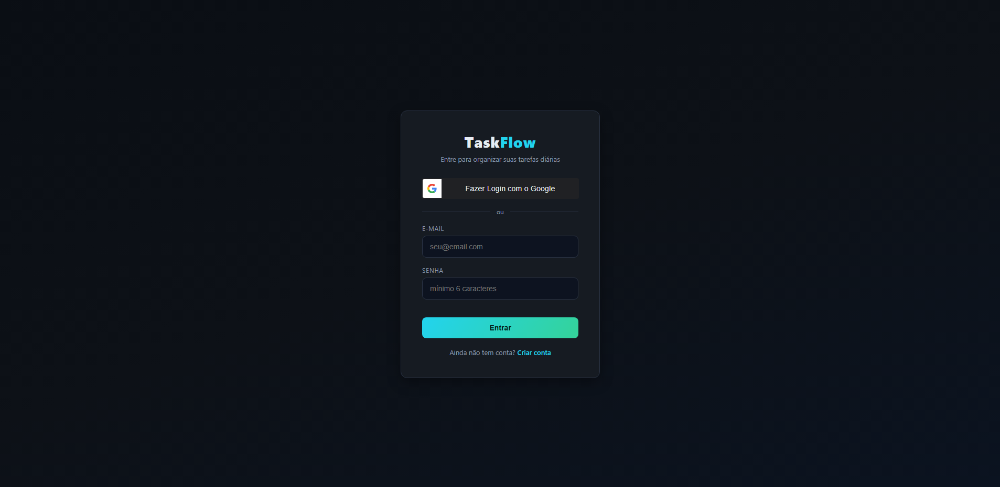

<div align="center">
  
> ⚠️ **Projeto proprietário** — código disponível apenas para visualização e avaliação técnica. Uso, cópia ou distribuição não autorizados são proibidos. Consulte o arquivo [LICENSE](./LICENSE).

# 📋 TaskFlow

### Quadro de tarefas estilo Kanban com sincronização em nuvem

Organize seu dia a dia com um board visual no estilo Trello — login seguro, dados salvos na nuvem e acesso de qualquer dispositivo, a qualquer hora.

[](https://mor3sco.github.io/lista-de-tarefas/)


</div>

---

## 🖥️ Preview



---

## 💡 Sobre o Projeto

O **TaskFlow** nasceu de um problema simples: listas de tarefas comuns não diferenciam o que está *pendente*, *em andamento* e *concluído* — e não ajudam a lidar com aquelas tarefas que sobraram do dia anterior.

Esse projeto resolve isso com:

- 🗂️ Um **quadro Kanban** (A Fazer · Em Andamento · Concluído)
- 📅 **Navegação por data**, para ver o que tinha programado em qualquer dia
- 🔁 **Carry-over inteligente**: tarefas não concluídas de dias anteriores aparecem com um aviso, e um clique as traz automaticamente para o dia atual
- 🔐 **Login real** (e-mail/senha ou conta Google), com dados sincronizados num banco de dados — funciona no celular, no notebook, em qualquer lugar

---

## ✨ Funcionalidades

| | |
|---|---|
| 🔐 | Login com e-mail/senha **ou** Google OAuth |
| 🗂️ | Quadro Kanban com 3 colunas (drag-and-drop) |
| 📱 | Botões rápidos ← → para mover tarefas no mobile |
| 📅 | Navegação livre entre datas |
| 🔁 | Carry-over automático de tarefas pendentes |
| 🎯 | Níveis de prioridade (alta, média, baixa) com cores |
| ☁️ | Sincronização em nuvem — acesse de qualquer dispositivo |
| ⚡ | Interface com atualização instantânea (optimistic UI) |
| 🌙 | Design dark, minimalista, inspirado em ferramentas modernas |

---

## 🏗️ Arquitetura

Projeto **full stack**, dividido em duas partes independentes:

```
┌────────────────────┐       HTTPS / JSON        ┌────────────────────┐
│      FRONTEND       │ ─────────────────────────▶│       BACKEND       │
│  HTML · CSS · JS     │ ◀─────────────────────────│  Node.js + Express   │
│   (Vercel/Pages)     │       API REST + JWT      │      (Railway)      │
└────────────────────┘                            └──────────┬──────────┘
                                                               │
                                                               ▼
                                                     ┌────────────────────┐
                                                     │     PostgreSQL       │
                                                     │    (via Prisma)      │
                                                     └────────────────────┘
```

```
taskflow/
├── backend/          # API REST — autenticação, tarefas, banco de dados
│   ├── prisma/        → schema do banco (User, Task)
│   └── src/
│       ├── controllers/
│       ├── middleware/
│       └── routes/
│
└── frontend/         # Interface — HTML, CSS, JS puro
    ├── index.html
    ├── style.css
    └── app.js
```

---

## 🛠️ Tecnologias

<div align="center">

**Frontend**


**Backend**


**Infraestrutura**


</div>

---

## 🔌 API REST

| Método | Endpoint | Descrição |
|---|---|---|
| `POST` | `/api/auth/register` | Cadastro com e-mail e senha |
| `POST` | `/api/auth/login` | Login com e-mail e senha |
| `POST` | `/api/auth/google` | Login/cadastro via Google |
| `GET` | `/api/auth/me` | Dados do usuário logado |
| `GET` | `/api/tasks/date/:date` | Tarefas de um dia específico |
| `GET` | `/api/tasks/all` | Todas as tarefas do usuário |
| `POST` | `/api/tasks` | Criar tarefa |
| `PUT` | `/api/tasks/:id` | Atualizar tarefa |
| `DELETE` | `/api/tasks/:id` | Excluir tarefa |
| `POST` | `/api/tasks/carry-over` | Trazer pendências para o dia atual |

---

## 🗺️ Roadmap

- [x] Quadro Kanban com drag-and-drop
- [x] Navegação por data + carry-over de pendências
- [x] Autenticação JWT + Google OAuth
- [x] Backend com PostgreSQL + Prisma
- [x] Notificações de tarefas atrasadas
- [x] Etiquetas/categorias personalizadas
- [x] Modo claro
- [x] Versão mobile (PWA)

---

## 👨‍💻 Autor

<div align="center">

**Evandro Moresco**

Full Stack Developer | JavaScript · TypeScript · React · Node.js | DevSecOps · OWASP

[](https://github.com/mor3sco)
[](https://linkedin.com/in/evandro-moresco)
[](https://oggisec.com)

</div>

<p align="center">
  Desenvolvido por <strong>Evandro Moresco</strong> · <a href="https://oggisec.com">Oggi Sec</a> — Segurança &amp; TI
</p>
